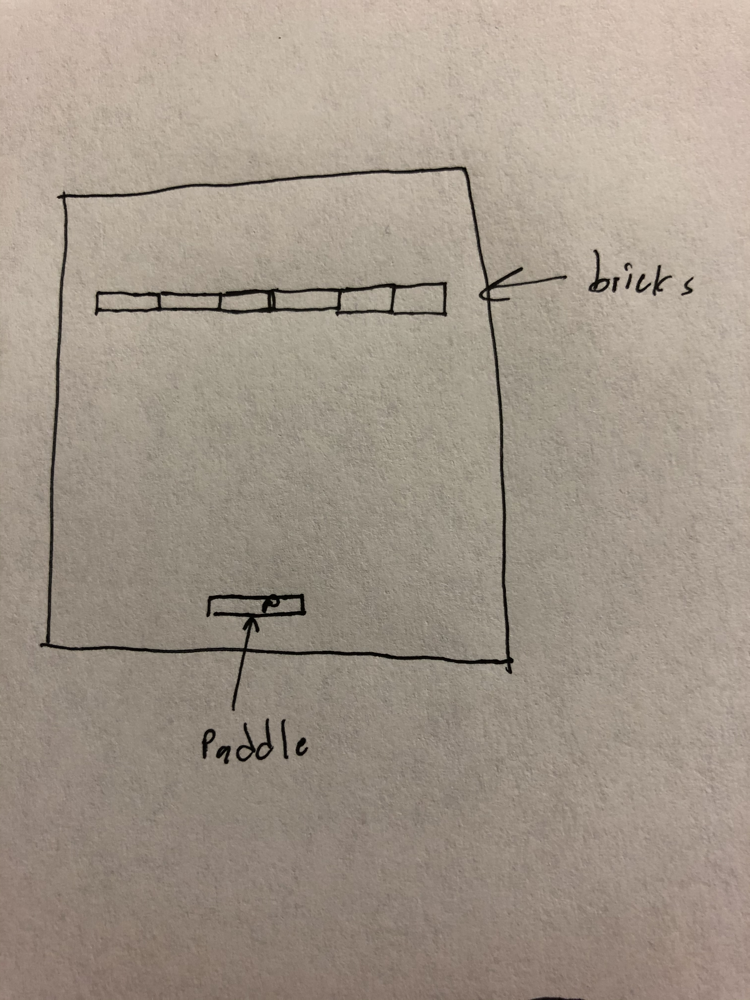
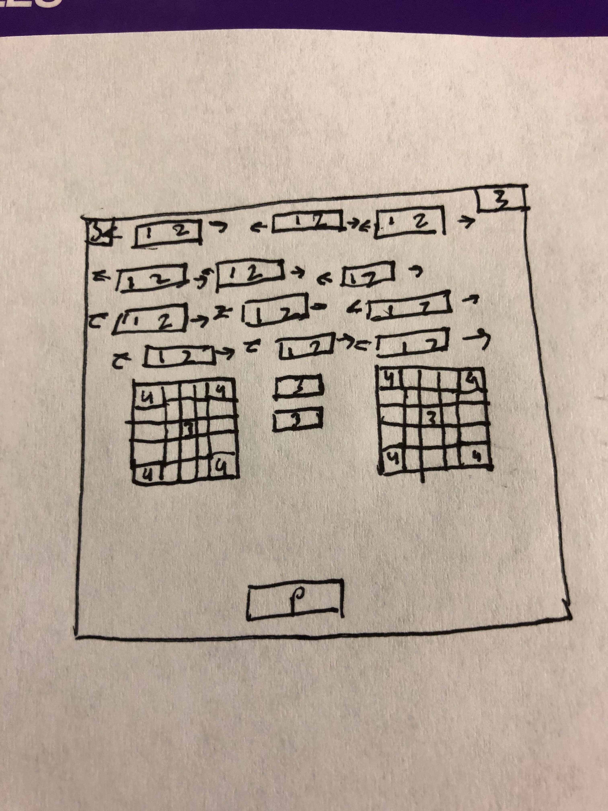
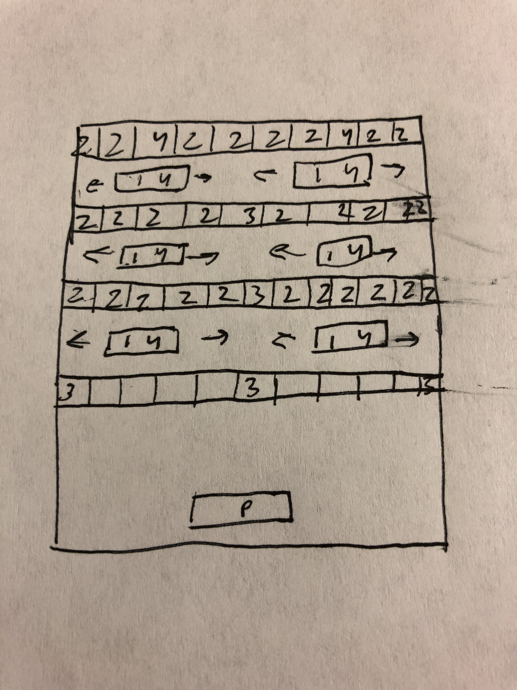

# Game Plan
## Milan Bhat (mb554)

### Breakout Variant

I thought that the Vortex variant of the Breakout game was the most interesting.
The game being circular rather than up and down was a unique twist 
that made it seem like the user has the ability to do more actions
than simply moving side to side. The ball bouncing into a tunnel
also made the game appear 3D which was a visually pleasing feature. 

### General Level Descriptions

With 1s representing moving bricks, 2s representing multi-hit bricks, 3s 
representing power-up brick, and 4s representing negative power up bricks, the levels will be as follows:

Level 1: The first level will be a single line of bricks so that the player can 
         become accustomed to the controls of the game.

Level 2: The second level will include 2 rows of moving bricks with 3 rows of 
stationary bricks between them. In the 3 middle rows, the top row will
be normal, stationary bricks, the middle row will be bricks that take multiple
hits to break, and the bottom row will alternate between normal and multi-hit bricks.
The two bricks on the end of the bottom row will be power-up bricks.

Level 3: The third level will have two large sets of bricks, with the 4 corners each being 
negative power ups. The middle brick in both of these will be a positive power up.
Above the large sets, there will be 4 rows of moving bricks that require
multiple hits to break. There will also be a power up in each of the 
top two corners.

Level 4: The fourth level will be 4 rows of bricks, with each row having
2 moving, negative power up bricks between them. The bottom row will have 3 
power up bricks, the middle two will have 1 each, and the top one will have 
none. The top 3 rows will also be completely made up of multi-hit bricks with
each row requiring more hits. The top row will also include 2 negative power up bricks.

If the player completes all 4 levels, they will be the winner. 

### Bricks Ideas

I would like to create a variety of bricks to make the game more interesting.
Firstly, I would create both horizontally-moving and stationary bricks. I would also make bricks
that require different numbers of hits to break, ranging from 1 to 20 hits.
Some bricks will also contain power-ups to help the player. 

### Power Up Ideas

My game would include power ups that affect either the ball or the 
paddle. Power ups on the ball could make the ball move slower, create multiple balls,
or create a "heavy" ball that counts as 2 hits on each brick. The paddle
could be powered up so that it moves faster or is bigger. Additionally,
I would create negative power-ups to make the game harder. These would make the ball move faster, shrink the paddle,
or make the paddle move slower. 

### Cheat Key Ideas

Cheat keys would be entered in the pause menu and could be used 
to move to a specific level or reset the ball and paddle. The numbers, 1-5 would 
be used to move to a different level while the number 6 would reset the ball and paddle. 
I would also include the cheat key 7 to add a life to the player.

### Something Extra

To extend on the game, I will include a score counter and a pause screen.
The pause screen is a significant addition because it will allow players
to take a break from the game while playing. If something makes the player
not be able to focus on the game anymore, they can simply click "P" to
pause the game. The pause will also bring up a menu that will allow the user
to restart the game or enter cheat keys. 
